# C‐ (C‐minus)

```
Un lenguaje para un proyecto de compilador
(Lauden, 2004)
Es un subconjunto considerablemente restringido de C.
Contiene:
o Enteros
o Arreglos de enteros
o Funciones (con tipo o void )
o Declaraciones (estáticas) locales y globales
o Funciones recursivas (simples)
o Condicional if‐else
o Ciclo while
o Función input() que lee desde el teclado
o Función output() que escribe a la pantalla
Un programa se compone de una secuencia de declaraciones de variables y funciones.
Al final debe declararse una función main.
La ejecución inicia con una llamada a main.
```
# Léxico de C‐ 
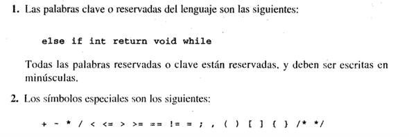
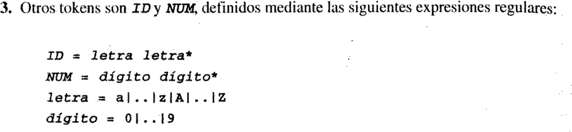

# Sintaxis de C‐ 
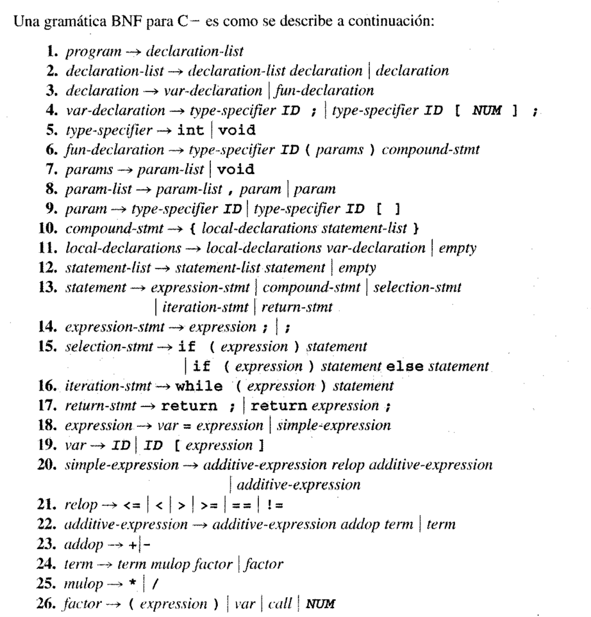
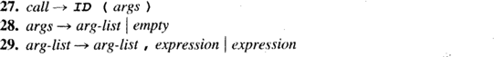

# Semántica de C‐ 
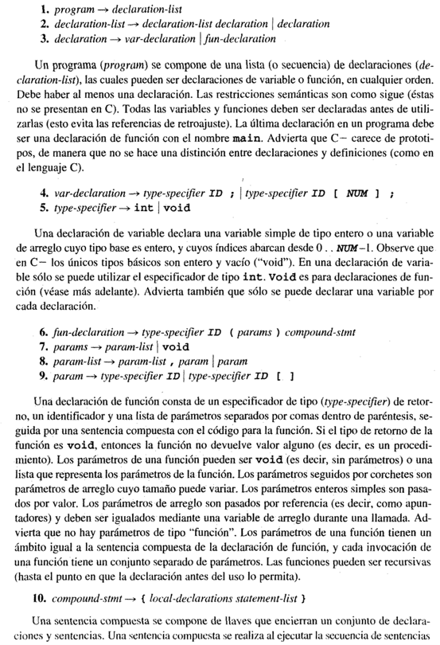
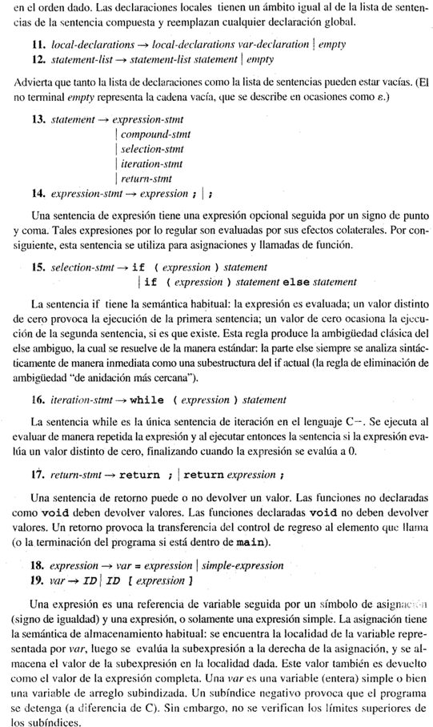
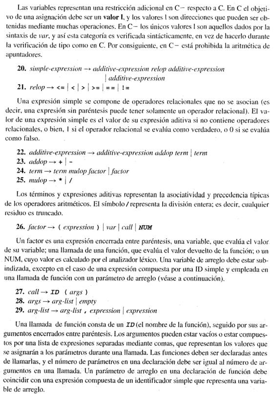
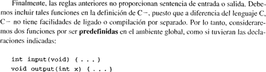

# Ejemplos de programas en C‐ 
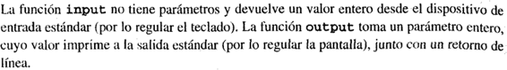
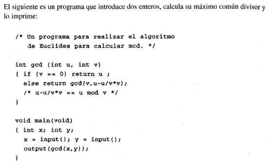
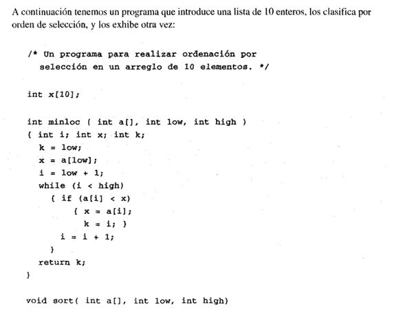
